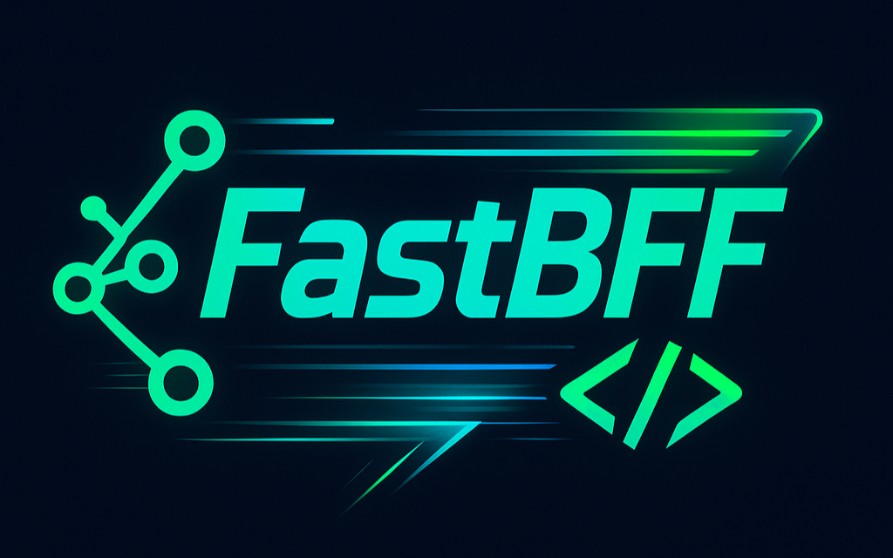

<p align="center">
  
</p>

**FastBFF** is a blazing-fast, configuration-driven **Backend-for-Frontend (BFF)** layer built on top of [FastAPI](https://fastapi.tiangolo.com/). It enables frontend developers and teams to define fully working REST APIs using just a simple YAML/JSON configuration file.

> "Stop writing backend glue, start shipping frontends faster."

---

## 🙌 Why FastBFF?

Because your frontend team shouldn’t be blocked by API scaffolding. FastBFF lets you:

- Build backend routes quickly without writing code
- Mock or proxy APIs during development
- Define rate limits and token-based auth per route

---

## 🚀 Features

- 🧾 **YAML/JSON-Powered** — define your endpoints and logic in a config file
- ⚡ **FastAPI-Based** — async, fast, and production-ready
- 🧪 **CLI Tooling** — validate config, init templates, start dev server
- 🔐 **Built-in Middleware Support** — per-route auth, rate limiting, etc.

---

## 📚 Requirements

- Python 3.8+
- pip

---

## ⚙️ Installation

```bash
git clone https://github.com/simonsayz13/fastbff
cd fastbff
python -m venv venv
source venv/bin/activate  # Windows: venv\Scripts\activate
pip install .
```

---

## 🧰 CLI Usage

### Generate Config File

```bash
fastbff init example --type json # generates example.json in the config folder
```
### Validate Config

```bash
fastbff validate example # validates the config file
```

### Start Server

```bash
fastbff serve example --env dev/prod
```

---

## 🛠 Example `example.yaml`

```yaml
startup:
  host: 127.0.0.1
  port: 9000
  title: ExampleAPI
  version: 1.0.0

routes:
  - path: /users
    method: GET
    source:
      type: static
      data:
        - id: 1
          name: "Alice"
        - id: 2
          name: "Bob"

  - path: /cat-fact
    method: GET
    source:
      type: proxy
      url: https://catfact.ninja/fact

  - path: /submit
    method: POST
    source:
      type: echo

  - path: /secret
    method: GET
    source:
      type: static
      data:
        msg: "top secret"
    auth: true
    auth_token: mysecrettoken
    limit_rate: true
    limit_count: 5
    limit_window: 60
```

---

## 🌐 Deployment

- ✅ Cloud-ready: works with Render, Fly.io, Railway, etc.
- 👨‍💻 For local dev: use `--env dev` for `127.0.0.1`, `--env prod` for `0.0.0.0`
- 🧪 Docker/CI/CD support coming soon

---

## 🧭 Roadmap

- [x] Support for loading external JSON/YAML files
- [ ] Support for additional HTTP methods (PUT, PATCH, DELETE, etc.)
- [ ] Route validation & OpenAPI schema generation
- [ ] Middleware (auth, rate-limiting, logging)
- [ ] Config-driven response transformation

---

## ✨ Contributing

PRs and feedback are very welcome. This is a weekend project growing fast, help shape it!

---
